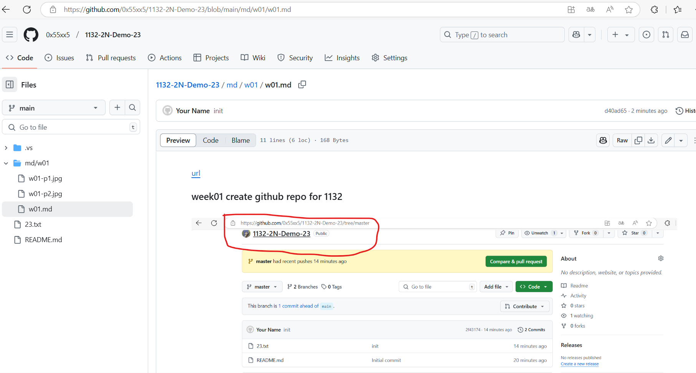
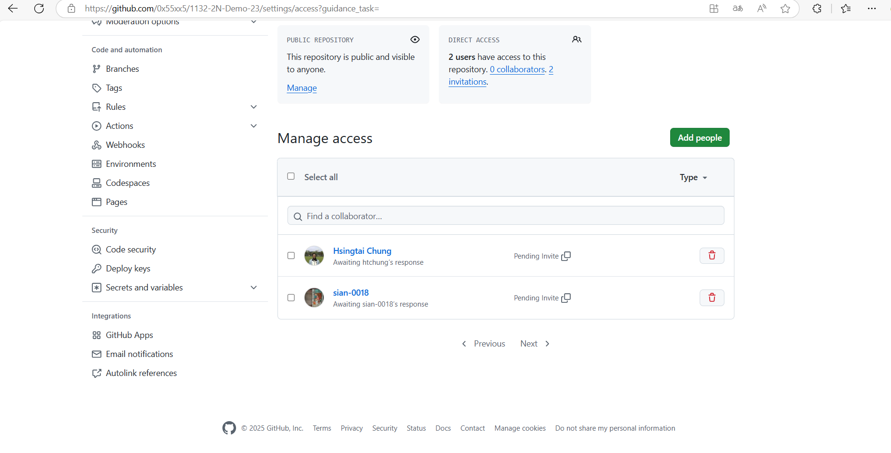
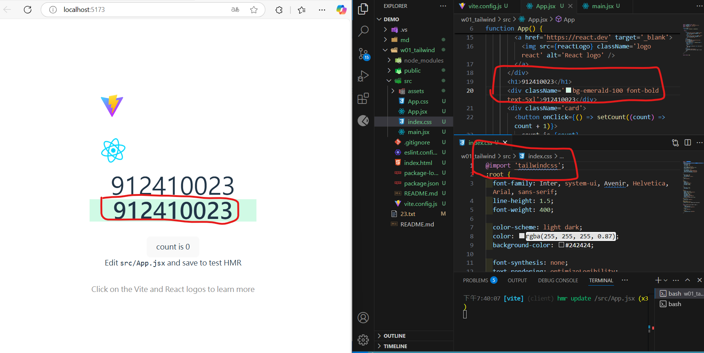
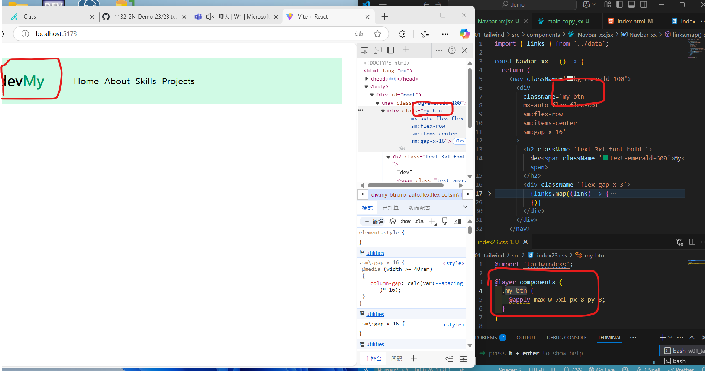
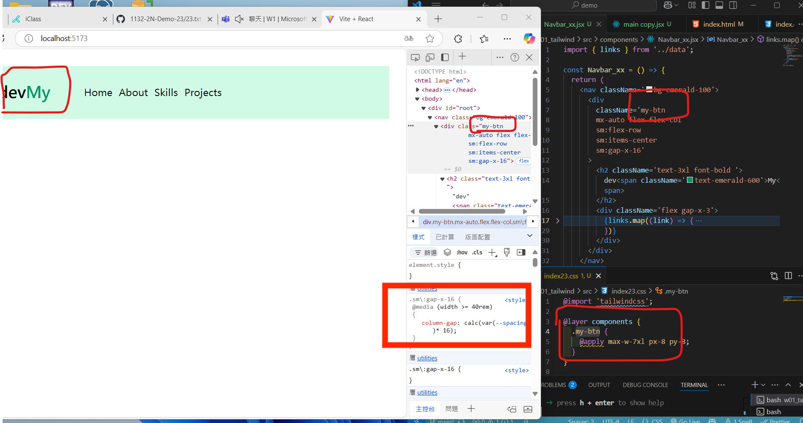

[url](https://github.com/0x55xx5/1132-2N-Demo-23/tree/main)

### w01-p1: week01 create github repo for 1132

####



#### sharing to tutorial



```

```

#### w01-p2: env for tailwindcss




### W01-P3: Show Navbar_xx responsive from links data
 
#### => for screen size < 640px
 

 
#### => for screen size > 640px (small)
 

 
```
ae81351 htchung Wed Feb 19 21:00:40 2025 +0800  W01-P3: Show Navbar_xx responsive from links data
```