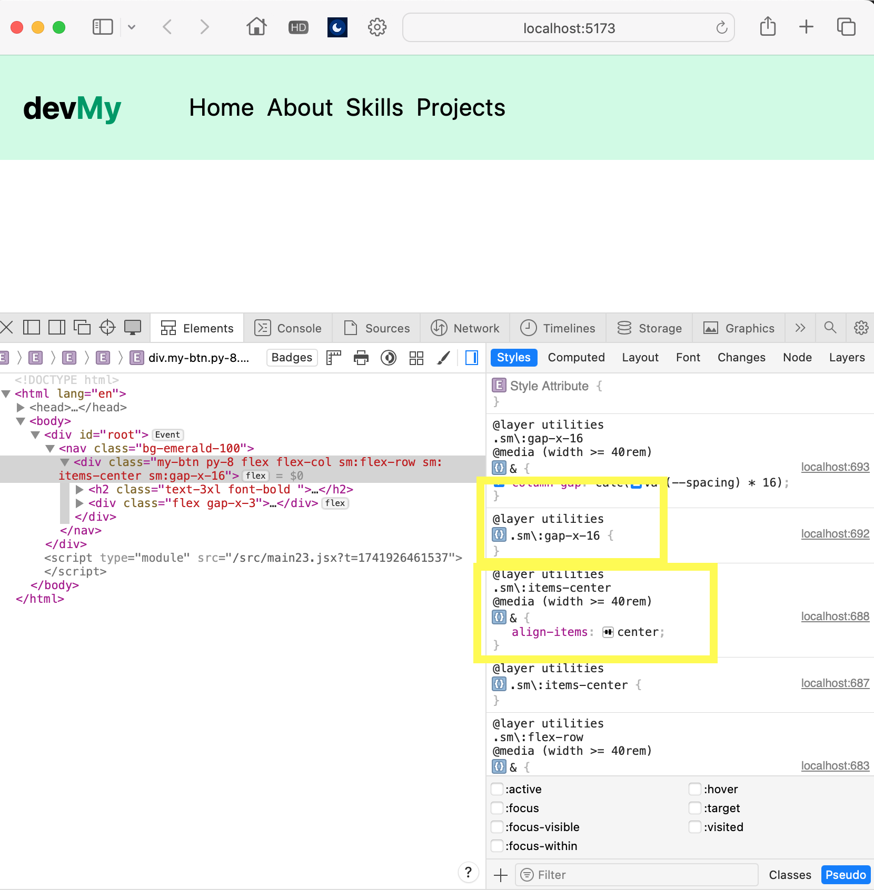

[url](https://github.com/0x55xx5/1132-2N-Demo-23/tree/main)

### w01-p1: week01 create github repo for 1132

####


#### sharing to tutorial


#### w01-p2: env for tailwindcss


### W01-P3: Show Navbar_xx responsive from links data
 
#### => for screen size < 640px
 

 
#### => for screen size > 640px (small)
 

 


## git log

```
5f0041          Wed Feb 19 21:04:27 2025 +0800  w01p3
1a22ab9         Wed Feb 19 19:46:31 2025 +0800  w01-p2
43b5034         Wed Feb 19 19:02:24 2025 +0800  mod miniors
d40ad65         Wed Feb 19 18:58:05 2025 +0800  init
2f43174         Wed Feb 19 18:38:33 2025 +0800  init

```