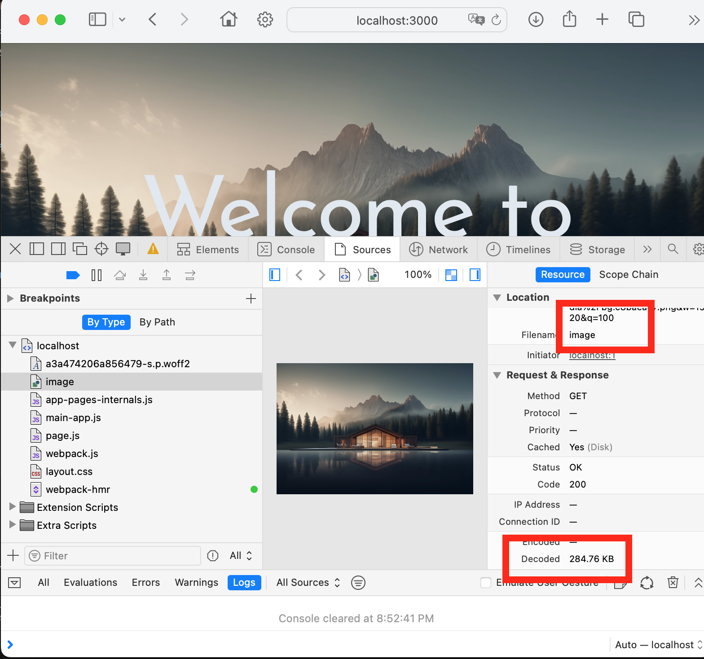
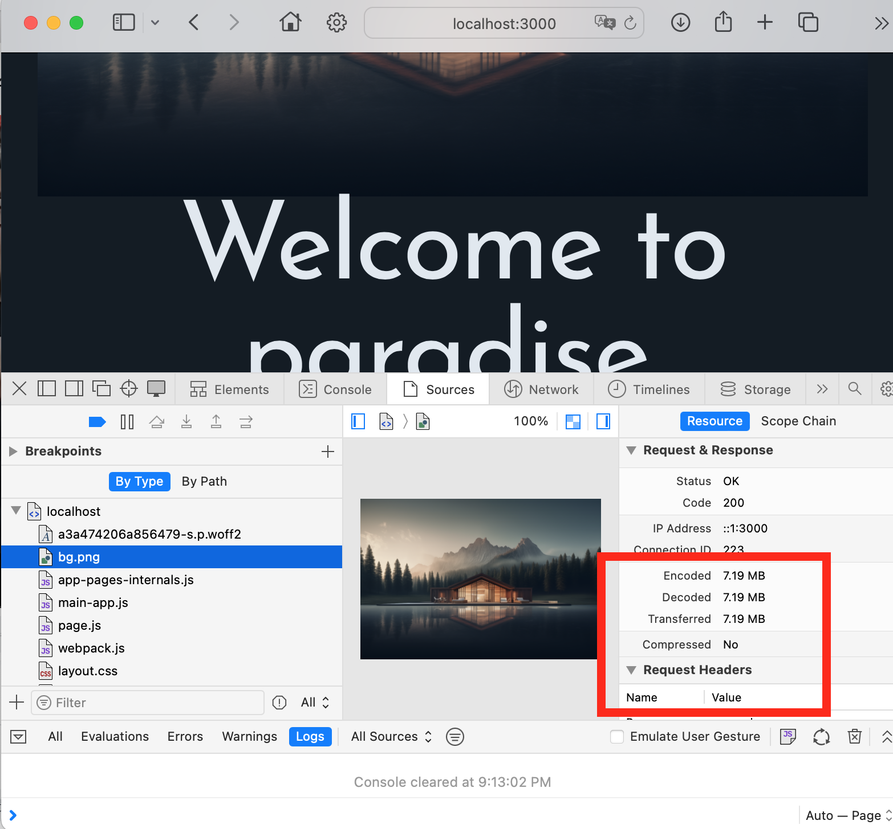
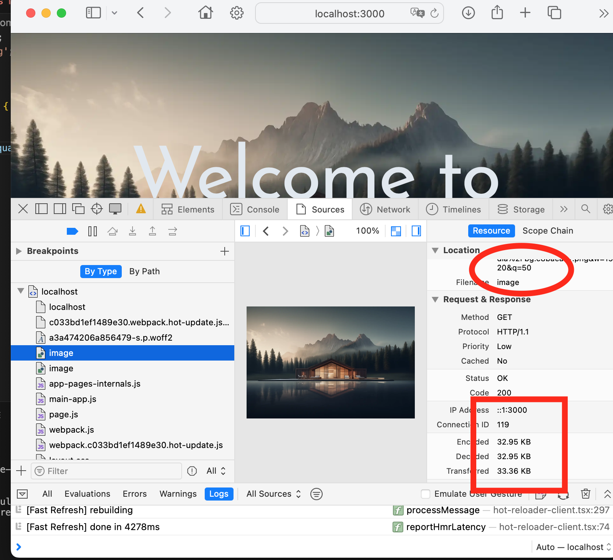

[url](https://github.com/0x55xx5/1132-2N-Demo-23/tree/main)


### W03-P1: Use Image quality to compare image size
 
#### => quality=100, image size = 107KB
 

 
#### => quality=60, , image size = 16.7KB
 

 
#### => original image size, size = 6.86 MB
 

 
```

```


### W03-P2: Show image size in About Page
 
#### => original image size, size = 1.1 MB
 

 
#### => use Image to optimize the image 
 

 
#### => use Image with quality=50
 

 
```

```
