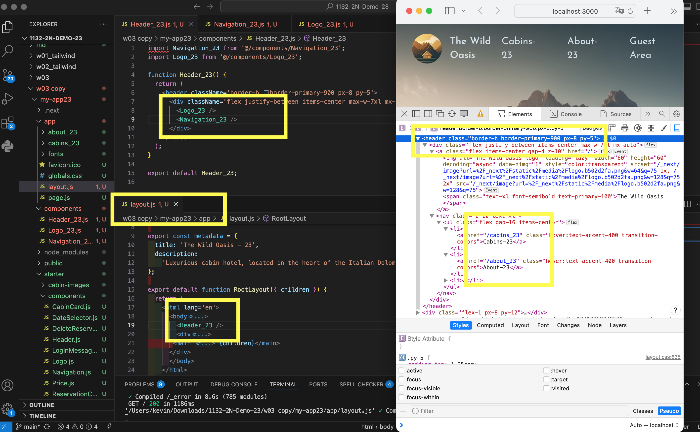
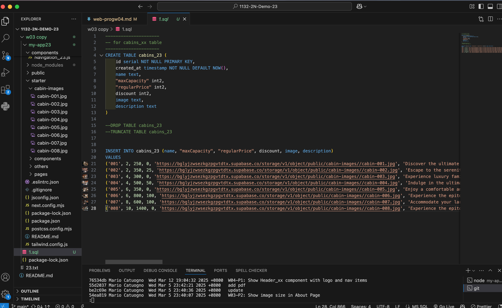
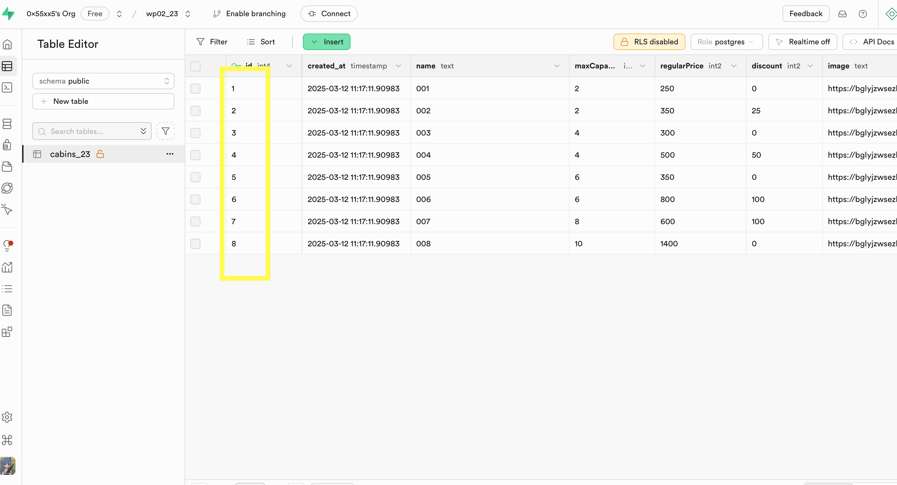
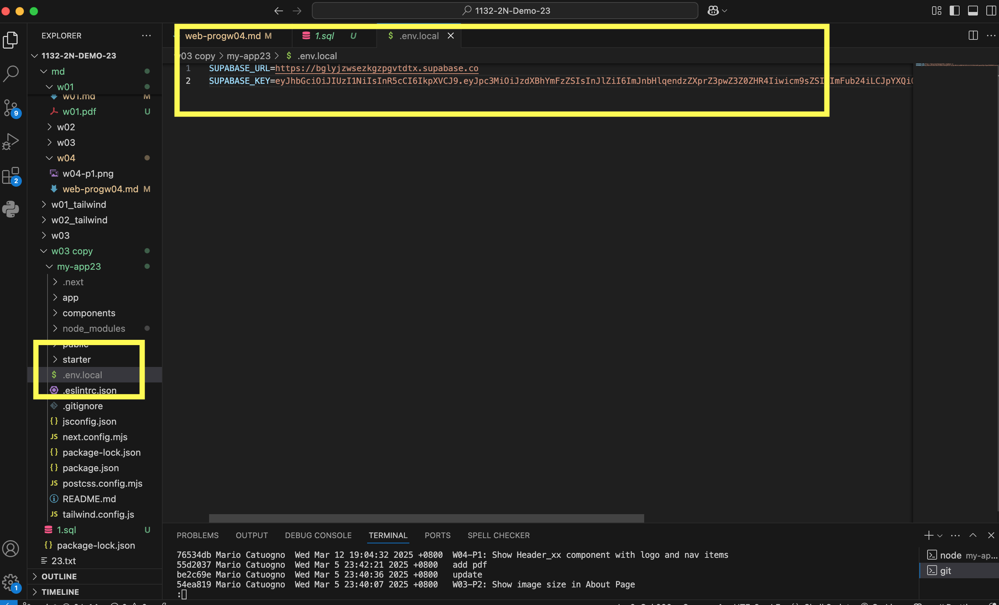
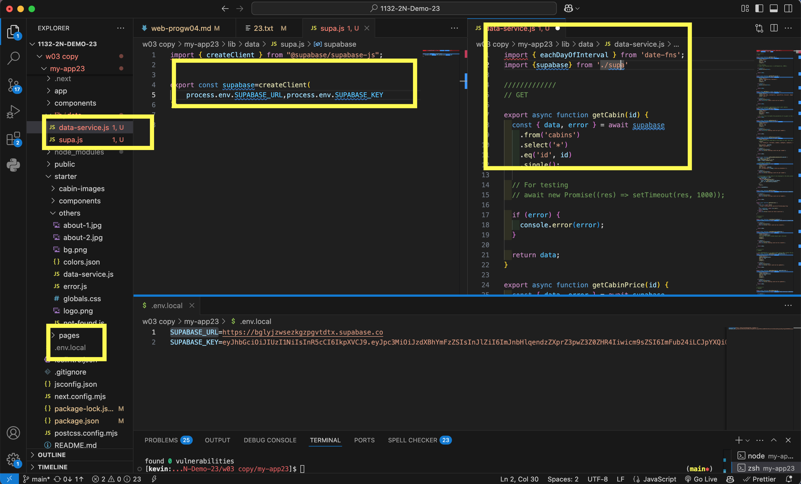
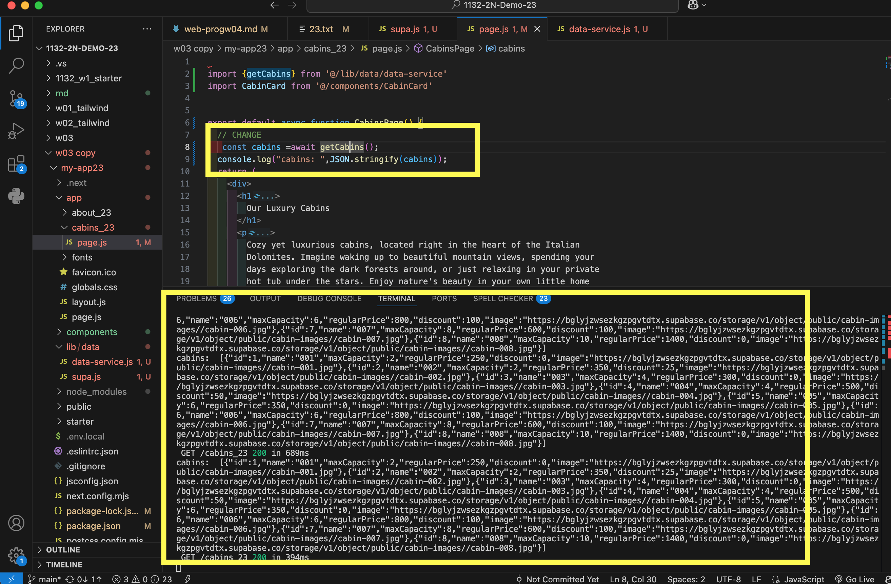
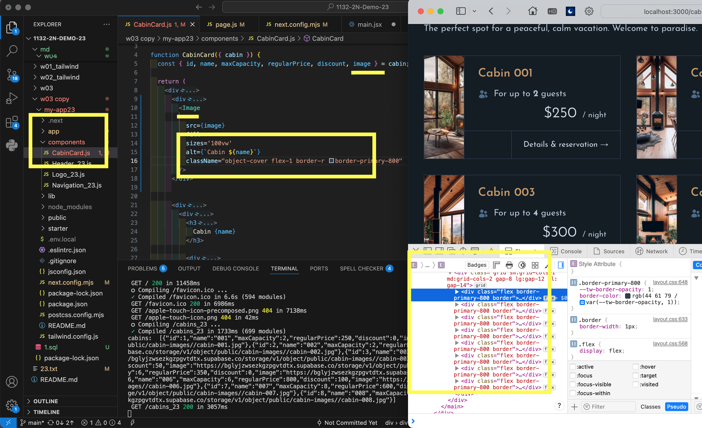

[url](https://github.com/0x55xx5/1132-2N-Demo-23/tree/main)


### W04-P1: Show Header_xx component with logo and nav items
 


```
76534db    Wed Mar 12 19:04:32 2025 +0800  W04-P1: Show Header_xx component with logo and nav items

```


### W04-P2: Create and get cabins data from Supabase

```

f75fc6d    Wed Mar 12 20:06:40 2025 +0800  W04-P2: Create and get cabins data from Supabase
```
 

#### => setup cabins_23 table (8 data)  !!note table name
 

 
#### => sql command to create and insert data
 

 
#### => show how to get Supabase URL and key
 

 
### => show how to use Supabase client to get cabins data
 

 
### => show cabins data in server console
 



### W04-P3: Show 8 cabins correctly in the browser
 

 
```

6cdffd6    Fri Mar 14 13:43:18 2025 +0800  W04-P3: Show 8 cabins correctly in the browser\
```

### git log 

```

6cdffd6    Fri Mar 14 13:43:18 2025 +0800  W04-P3: Show 8 cabins correctly in the browser
f75fc6d    Wed Mar 12 20:06:40 2025 +0800  W04-P2: Create and get cabins data from Supabase
76534db    Wed Mar 12 19:04:32 2025 +0800  W04-P1: Show Header_xx component with logo and nav items
```
