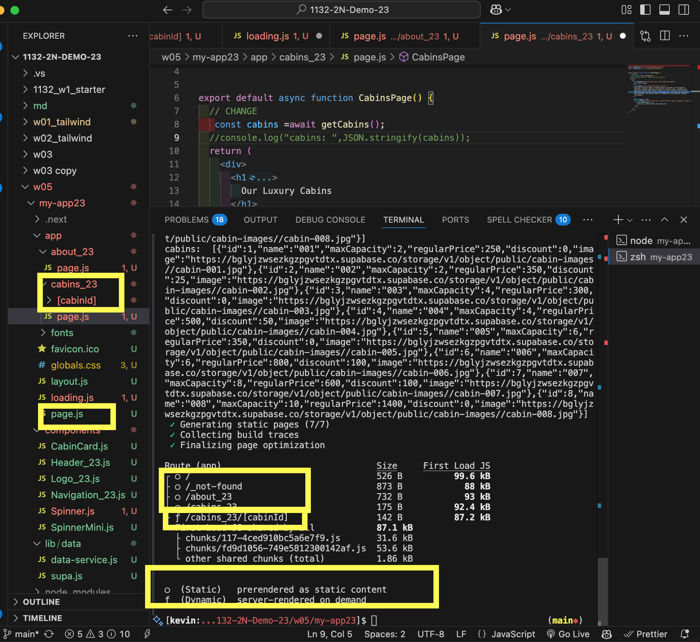
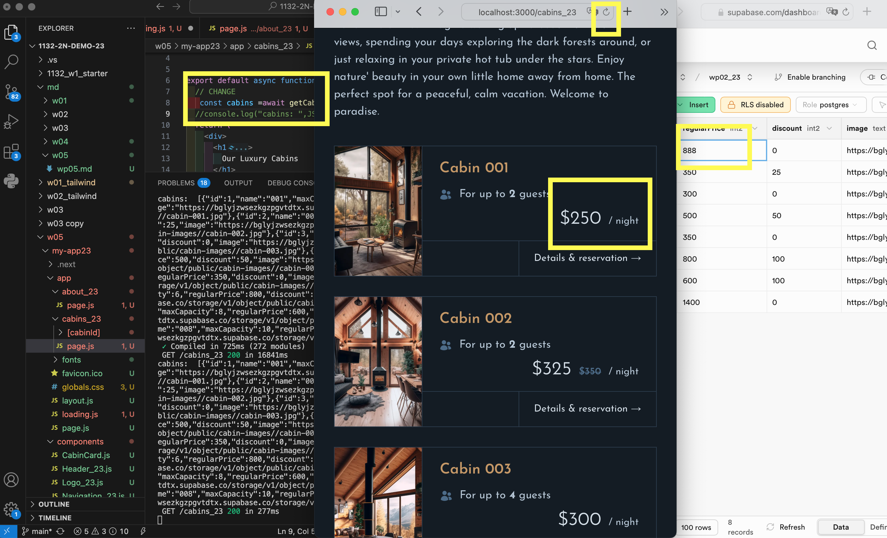
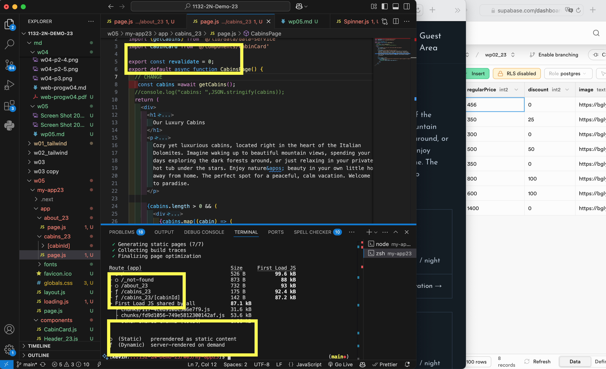
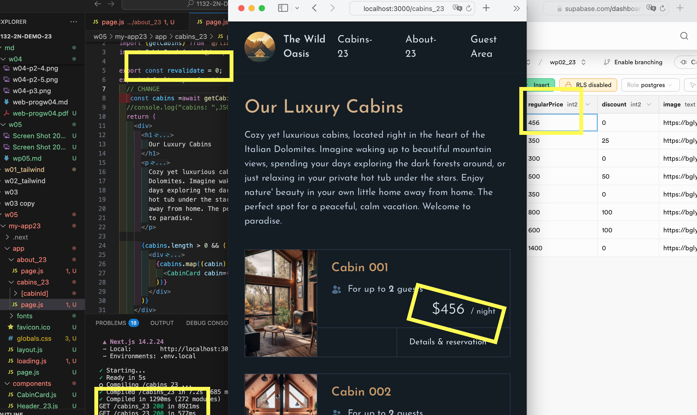
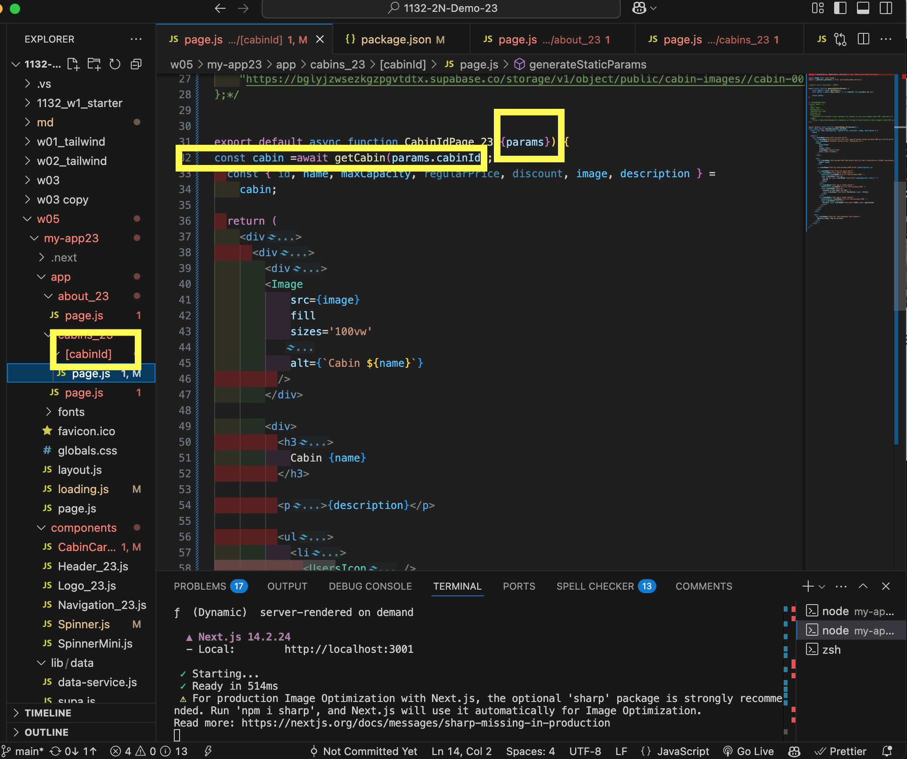
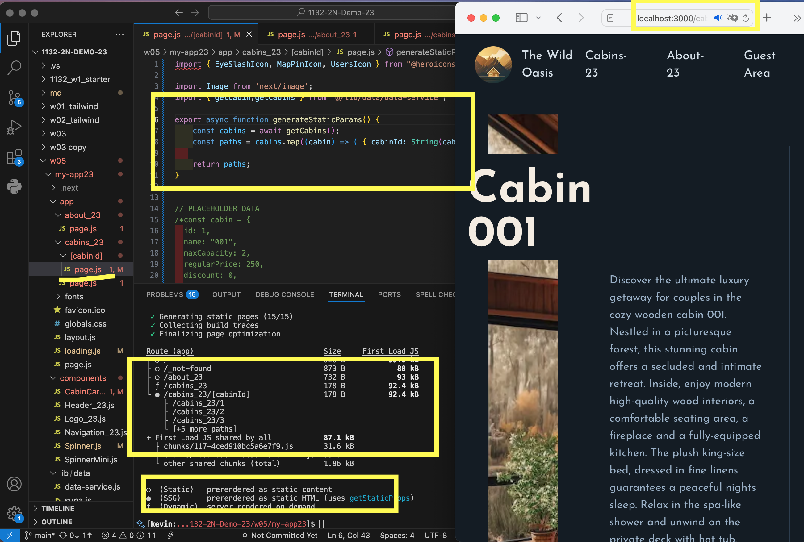
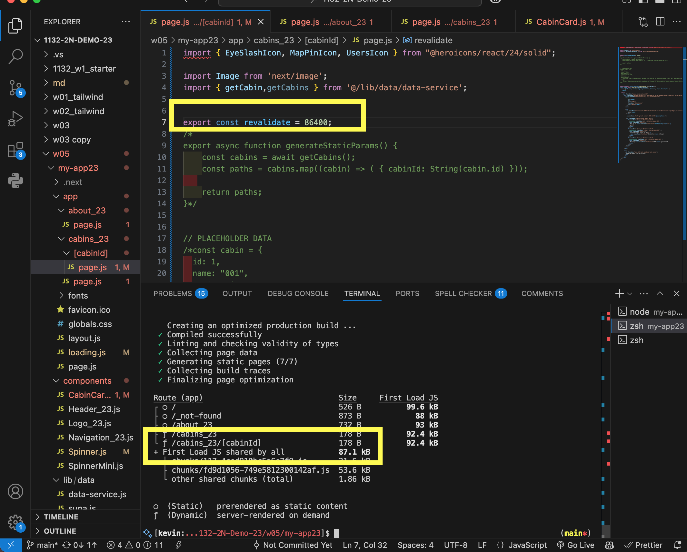
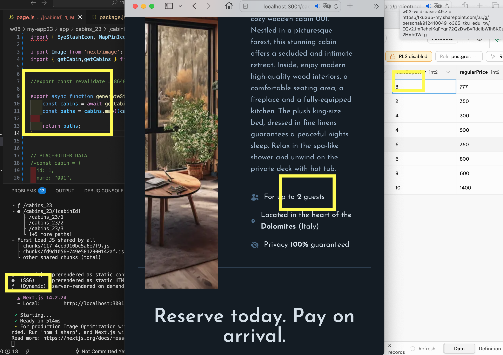

[url](https://github.com/0x55xx5/1132-2N-Demo-23/tree/main)


### W05-P1: W05-P1: use route /cabins_xx to show static rending and dynamic rendering
 
#### => Show route /cabins_xx as static route by using "npm run build" command
 

 
#### => change the price of cabin 1 in Supabase from 250 to 300, and refresh page, nothing change
 

 
#### => Show route /cabins_xx as dynamic route by using "npm run build" command
 

 
#### => change the price of cabin 1 in Supabase from 300 to 456, and refresh page, price does change
 


 
```
b88b309 05235   Wed Mar 19 19:53:46 2025 +0800  W05-P1: use route /cabins_xx to show static rending and dynamic renderingW04-P3: Show 8 cabins correctly in the browser
```
 


### W05-P2: Implement route /cabins_xx/cabinId, and use SSG (Static Site Generation) approach
 
#### => Implement route /cabins_xx/cabinId using generateStaticParams()
 

 
#### => show route /cabins_xx/cabinId as SSG
 

 
#### => change route /cabins_xx/cabinId to dynamic route
 

 
#### => run route /cabins_xx/cabinId as SSG and change maxCapacity in Supabase, nothing happen
 

 
```
d118181 05235   Wed Mar 19 21:03:21 2025 +0800  Implement route /cabins_xx/cabinId, and use SSG (Static Site Generation) approach

```

### git log 

```
d118181 05235   Wed Mar 19 21:03:21 2025 +0800  Implement route /cabins_xx/cabinId, and use SSG (Static Site Generation) approach
b88b309 05235   Wed Mar 19 19:53:46 2025 +0800  W05-P1: use route /cabins_xx to show static rending and dynamic renderingW04-P3: Show 8 cabins correctly in the browser
```
