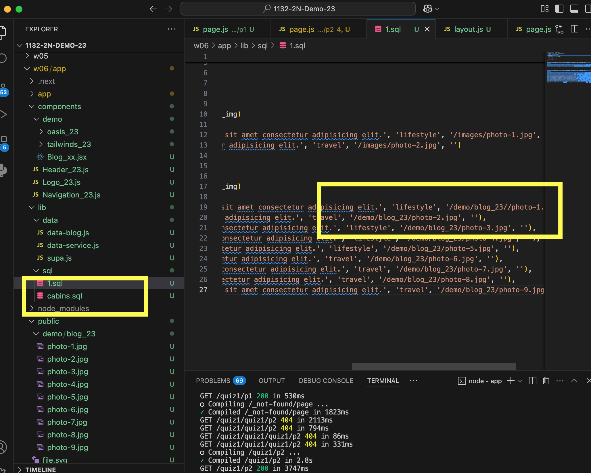

[url](https://github.com/0x55xx5/1132-2N-Demo-23/tree/main)

vercel

[url]()

#### W06-P1: Show navigation for p1_xx, p2_xx, p3_xx, p4_xx
 


 
```
df8a53e 05235   Sat Mar 29 22:30:10 2025 +0800  W06-P1: Show navigation for p1_xx, p2_xx, p3_xx, p4_xx
```

#### W06-P2: Implement route /quiz1/p1_xx to show all cabins
 

 
```
e77694b 05235   Sat Mar 29 22:31:09 2025 +0800  W06-P2: Implement route /quiz1/p1_xx to show all cabins
```

### W06-P3: Implement route /quiz1/p2_xx to show static blogs
 
#### => show static blogs
 

 
#### => show blog_xx.sql with img pointing to /demo/blog_xx directory
 

 
```
64ad67f 05235   Sat Mar 29 22:32:25 2025 +0800  W06-P3: Implement route /quiz1/p2_xx to show static blogs
```

### W06-P4: Implement route /quiz1/p3_xx to show all blogs in Vercel
 


 
```

```


### git log 

```

64ad67f 05235   Sat Mar 29 22:32:25 2025 +0800  W06-P3: Implement route /quiz1/p2_xx to show static blogs
e77694b 05235   Sat Mar 29 22:31:09 2025 +0800  W06-P2: Implement route /quiz1/p1_xx to show all cabins
df8a53e 05235   Sat Mar 29 22:30:10 2025 +0800  W06-P1: Show navigation for p1_xx, p2_xx, p3_xx, p4_xx
```
 