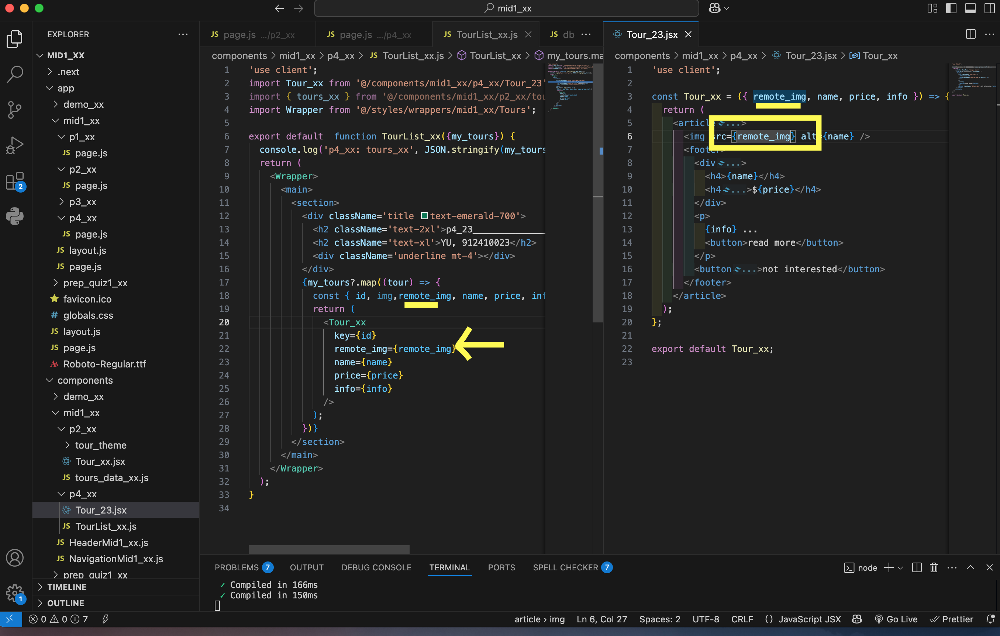
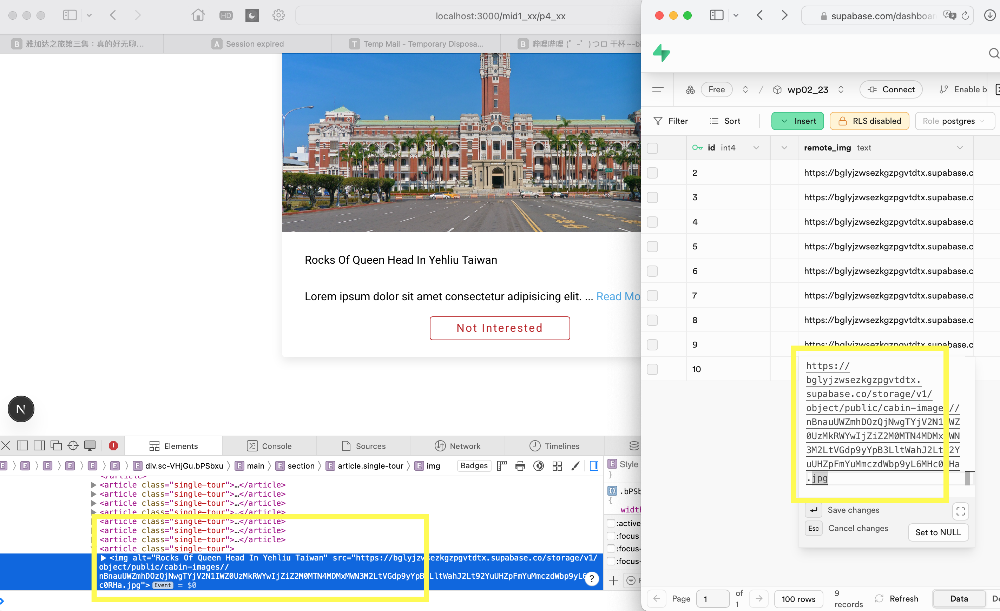
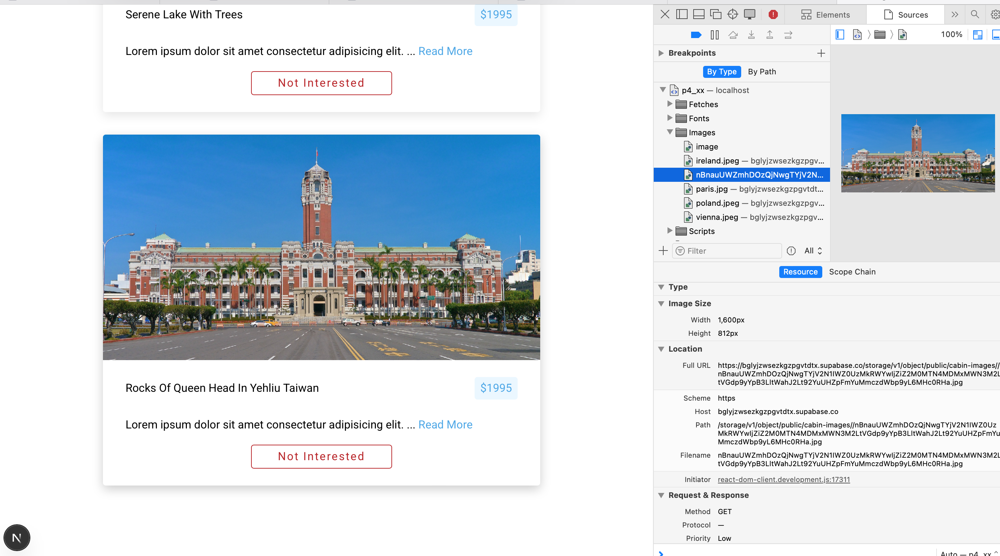
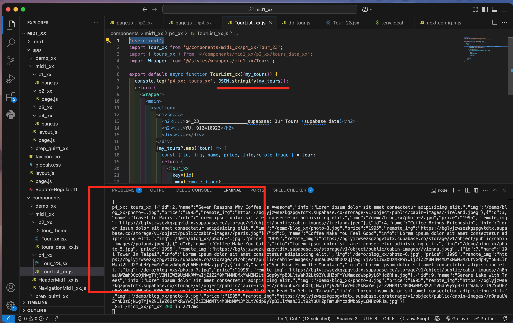
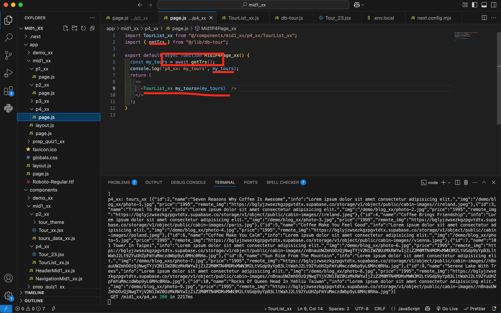
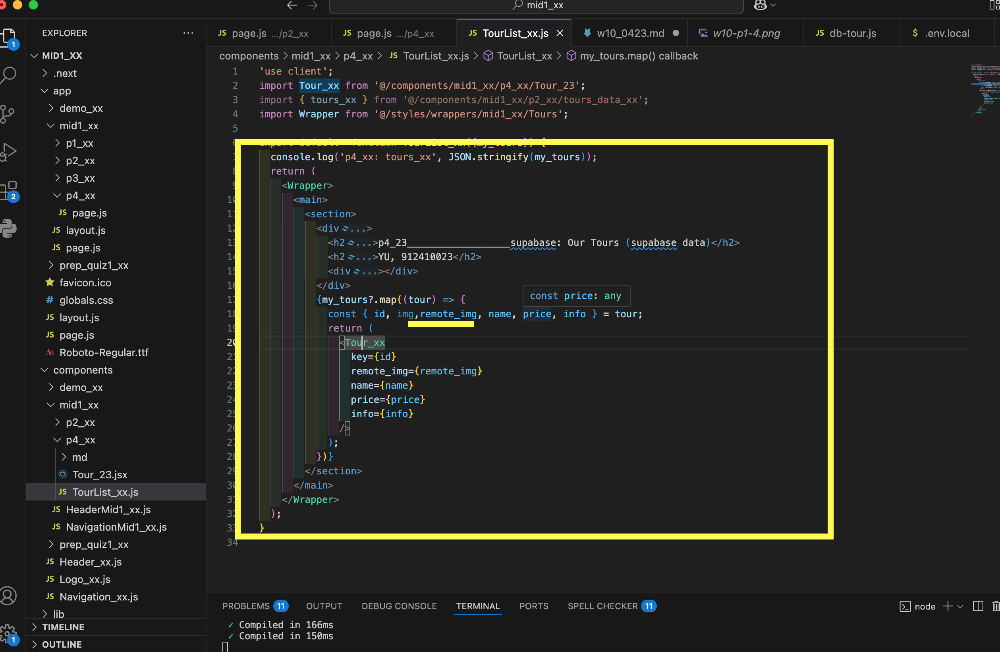
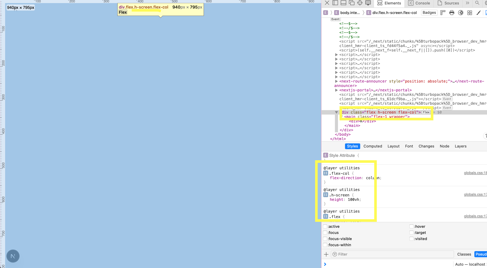
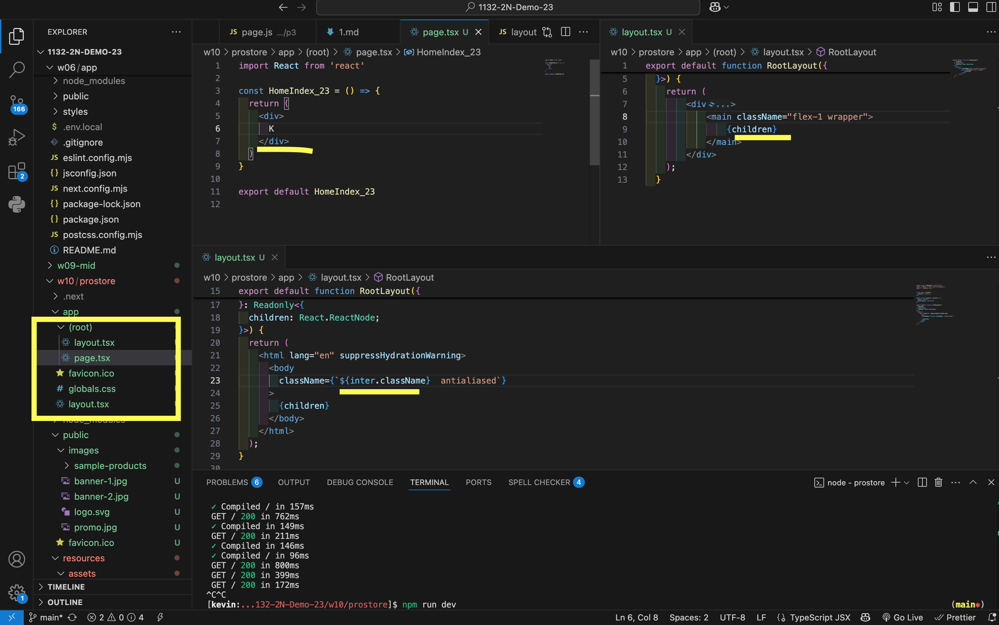
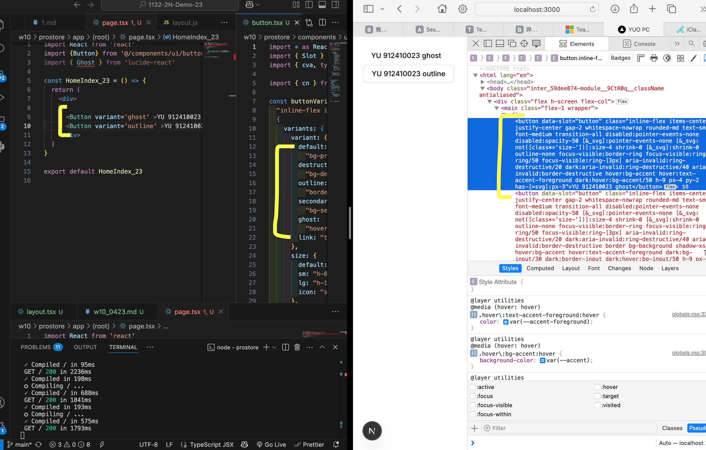

[url](https://github.com/0x55xx5/1132-2N-Demo-23/tree/main)

vercel

[url]()
#### W10-P1: Do p4_xx in midterm
 
#### => p4_xx/page.jsx and TourList_xx component
 

 
#### => Supabase with 3 tours as described in the midterm exam
 

 
#### => Get 3 tour images from Supabase storage
 


 
#### => show the code of how to get remote image from Supabase storage
 


 
```
3bd6b09 05235   Wed Apr 23 21:03:16 2025 +0800  W10-P2: Prostore root layout and wrapper utility

```
 


### W10-P2: Prostore root layout and wrapper utility
 




 
```
3bd6b09 05235   Wed Apr 23 21:03:16 2025 +0800  W10-P2: Prostore root layout and wrapper utility
```
### W10-P3: shadcn UI button




### git log

```
0b0cc42 05235   Wed Apr 23 21:08:51 2025 +0800  W10-P3: shadcn UI button
3bd6b09 05235   Wed Apr 23 21:03:16 2025 +0800  W10-P2: Prostore root layout and wrapper utility
W10-P1: Do p4_xx in midterm
```