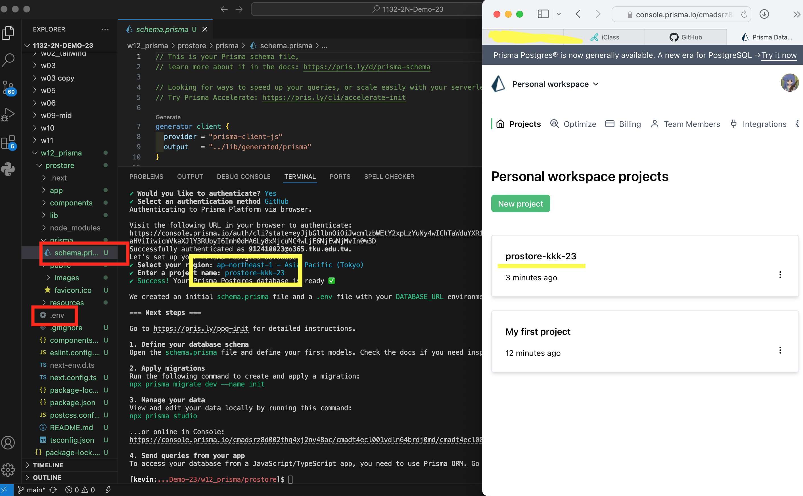
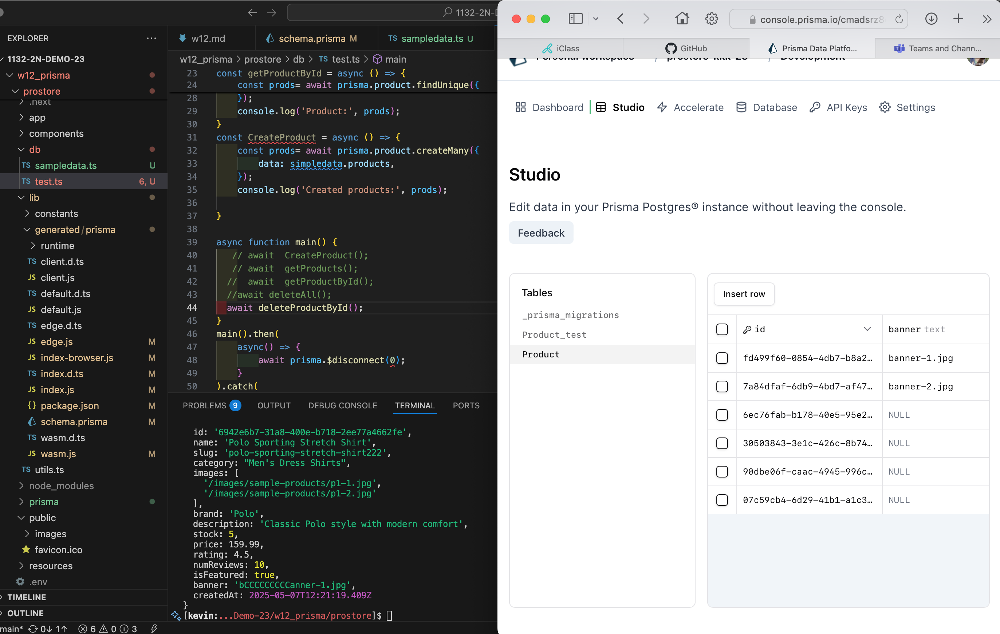

[url](https://github.com/0x55xx5/1132-2N-Demo-23/tree/main)

vercel

[url]()
#### W12-p1: npx prisma init --db

#### W12-p1-1: migration

### W12-P2: Do insert, get, delete operations on Product table
 
#### => create data from sample-data.ts
 

 
#### => get all products from Product table
 

 
#### => delete all products from Product table
 

 
#### => create data from sample-data.ts again
 

### W12-P3: 

