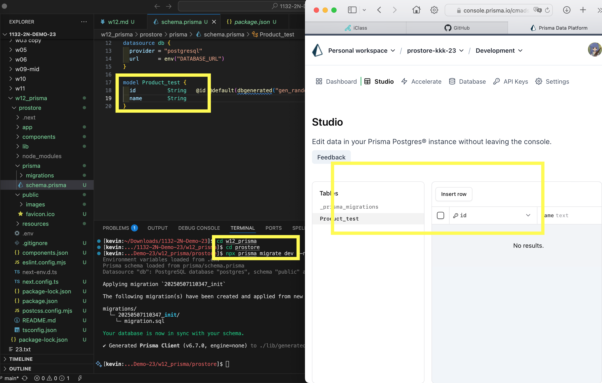
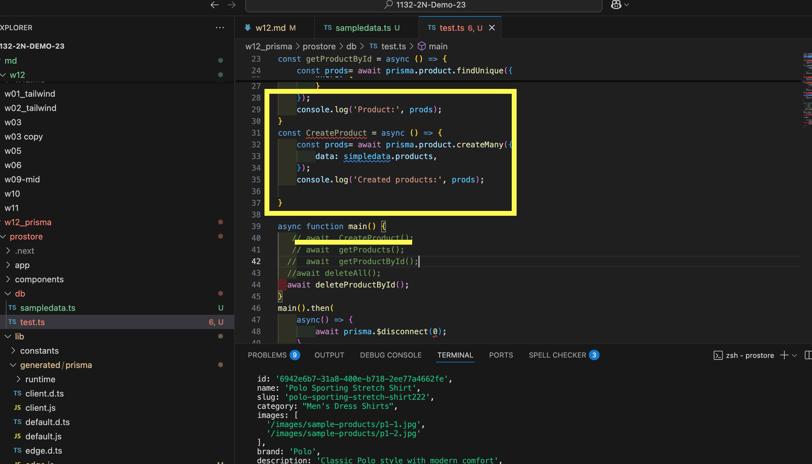

[url](https://github.com/0x55xx5/1132-2N-Demo-23/tree/main)

vercel

[url]()
#### W12-p1: npx prisma init --db


#### W12-p1-1: migration




### W12-P2: Do insert, get, delete operations on Product table
 
#### => create data from sample-data.ts
 

 
#### => get all products from Product table
 


 
#### => delete all products from Product table
 


 
#### => create data from sample-data.ts again
 


### W12-P3: 


#### => get all products
 

 
#### => get products with brand 'Polo'
 

 
#### => show how to use $queryRaw(query)
 


### git log

```
97fa24b 05235   Wed May 7 21:00:11 2025 +0800   week12 p3
0b4a4f2 05235   Wed May 7 19:09:41 2025 +0800   week12 p1-p2
```
