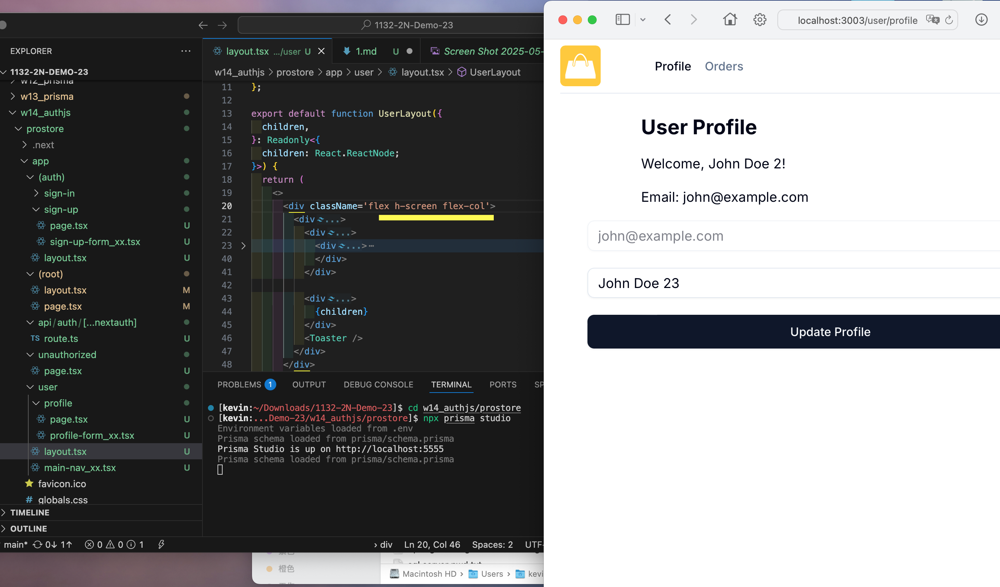

### W15-P1: Make sign-in and sign-up work
 
#### => sign-in, check session user
 

 
#### => sign-in related code
 

 
#### => sign-up, check session user
 

 
#### => sign-up related code
 

 
```

```


### W15-P2: Menu and UserButton
 
#### => how sheet is displayed in responsive mode
 

 
#### => UserButton with items associated with it
 

 
```

```
 

 ### W15-P3: Show how to show /user/profile
 
#### => show layout with 2 parts, nav and profile info
 

 
#### => show how header is composed with 3 parts

 

 
```

```

### W15-P4: Show how to show update user name
 
#### => show the code of displaying in the browser
 

 
#### => show how data is updated in database
 

 
```

```
 

 ### gitlog

```
4cfe82f 05235   Fri May 30 07:02:23 2025 +0800  add profile
0644e34 05235   Fri May 30 07:00:54 2025 +0800  add profile
```
